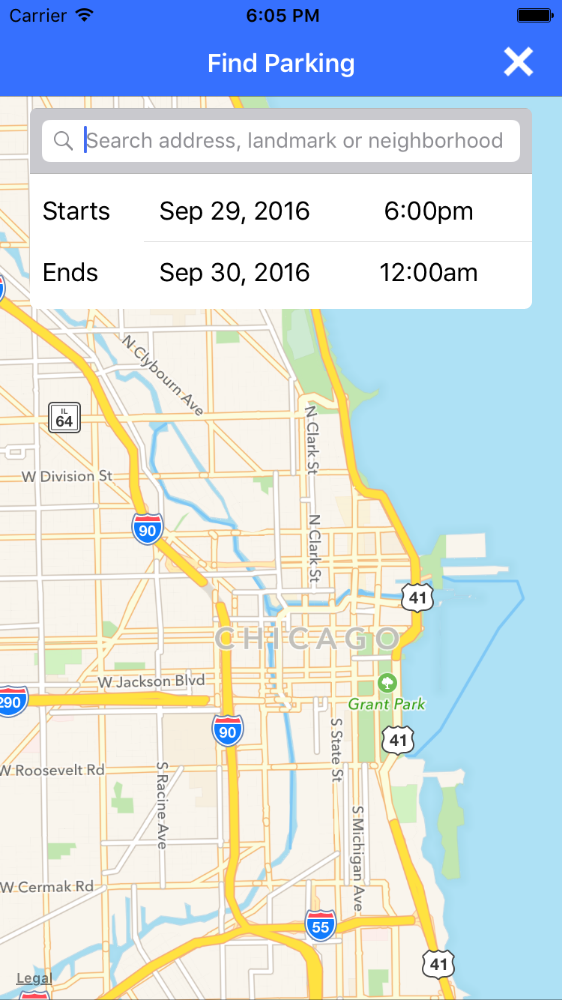
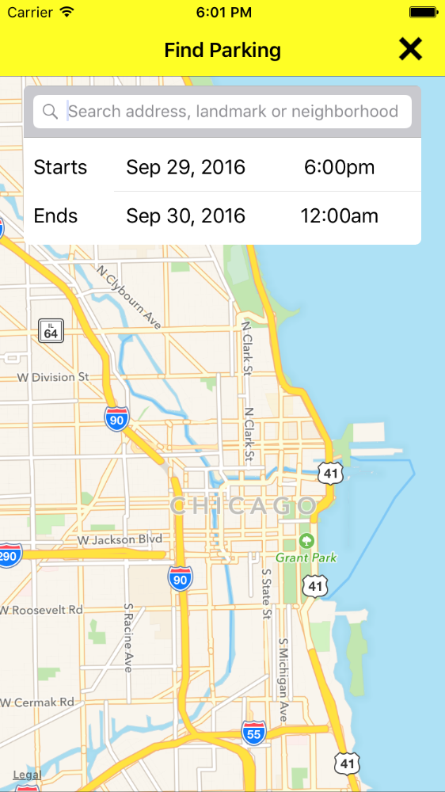

# iOS-Partner-SDK

The SpotHero SDK for partner applications

## Getting Started 

To add the SpotHero iOS Partner SDK to your application, you need a SpotHero Partner Key. [TODO: FROM WHENCE]

The SpotHero SDK is implemented as a singleton which can be launched from any `UIViewController` subclass. It will be presented modally. There is only one **required** property which must be set:

- `partnerApplicationKey: String`: Your application's partner key.

If a partner application key is not provided, during debugging you will hit an assertion failure and in production, the SDK will not be launched. 

The absolute bare minimum implementation, assuming you have a button hooked up to this IBAction, is as follows: 

```swift
@IBAction private func launchSDKButtonPressed(sender: AnyObject) {
	let spotHeroSDK = SpotHeroPartnerSDK.SharedInstance        

	//Partner key: REQUIRED
	spotHeroSDK.partnerApplicationKey = "Your SpotHero Partner Key Here"
        
	//Ignition, and liftoff!
	spotHeroSDK.launchSDKFromViewController(self)
}
```

The sample application for this pod includes an example of how to get the simplest integration up and running. 

If you use the default options, the SDK should launch looking something like this: 



## Configurable Options

There are a couple of options you may configure to have the SDK look a bit more at home in its host application. They are: 

- `tintColor: UIColor`: The tint color to use for the background of the nav bar.
- `textColor: UIColor`: The text color to use on buttons and titles in the navigation bar.

Here is an example of that same `IBAction` with the  optional items set up: 

```swift
@IBAction private func launchSDKButtonPressed(sender: AnyObject) {
	let spotHeroSDK = SpotHeroPartnerSDK.SharedInstance
        
	//Partner key: REQUIRED
	spotHeroSDK.partnerApplicationKey = "Your SpotHero Partner Key Here"
        
	//Text Color for nav bar: OPTIONAL
	spotHeroSDK.textColor = .blackColor()
        
	//Tint color for nav bar: OPTIONAL
	spotHeroSDK.tintColor = .yellowColor()
        
	//Ignition, and liftoff!
	spotHeroSDK.launchSDKFromViewController(self)
}
```

And here is what it would look like on launch (assuming you just went with the hard-coded name): 



## Debugging Help 

If you are running into problems and you would like to see a very, very large amount of detail about the calls going to and from the SpotHero server, you may change the `debugPrintInfo` property on the SDK singleton to `true`. 

For security reasons, we ask that you ensure this is **not** set to `true` in any release builds. The default value is `false`, so if you do not actively change it, you're fine. 
